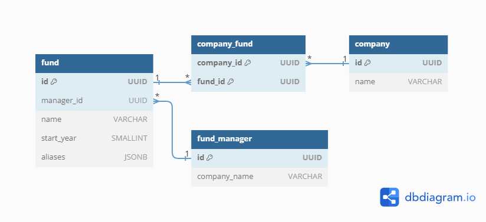

# Run the project

In order to run the project, you need to have Docker installed. With it correctly installed, run the following command:

```bash
docker-compose up -d
```

This will create an image with PHP 8.3 and the following tools installed:
- composer
- zip / unzip
- extensions:
  - pdo_pgql
  - amqp

This image will be used for three different tasks:

1. Run the migrations that set up the (PostgreSQL) database;
2. Execute a consumer that will listen for messages related to duplicate funds;
3. Run the web application with the following endpoints:
    - `GET /funds?name={name}&startYear={startYear}&managerId={managerId}&alias={oneOfTheAliases}&limit=10&offset=0`: list all funds (paginated);
    - `POST /funds`: create a new fund;
    - `PUT /funds/{id}`: update a specific fund;
    - `POST /managers`: create a new manager;
    - `GET /managers?offset=0`: list all managers (paginated with 10 items per page);

## Explanations

You will find a few different approaches in the project. That was done on purpose to show different ways of doing the same thing.

For example, the `FundManagerRepository::paginated` returns an instance of `Paginator`, which can bring more power in "fullstack" applications, but requires creating the query builder even for a simple `findAll` scenario.

On the other hand, the `FundRepository` has the `findBy` method overridden and takes into consideration the pagination options with default values.

### Lack of other features

Unfortunately, I only had tonight (Thursday) after work to work on this project. I would have loved to add more features, such as:
- Automated testing;
- Better organization using Clean Architecture (creating UseCases, interfaces for the repositories, etc);
- External logging tool;
- OpenTelemetry for observability;
- More thorough documentation;

But I believe that the current state of the project is a good start to show my skills and how I would approach a project. I am open to answer any questions that may come up, and I would also love to hear any feedback one may have.

### Non-implementation of Company entity

Since the only "required" endpoints were related to Funds and I had very limited time, I decided to not implement the Company entity, but the following [ER diagram](https://dbdiagram.io/d/656965c03be14957871962f5) contains the modeling of the ManyToMany relationship. 

